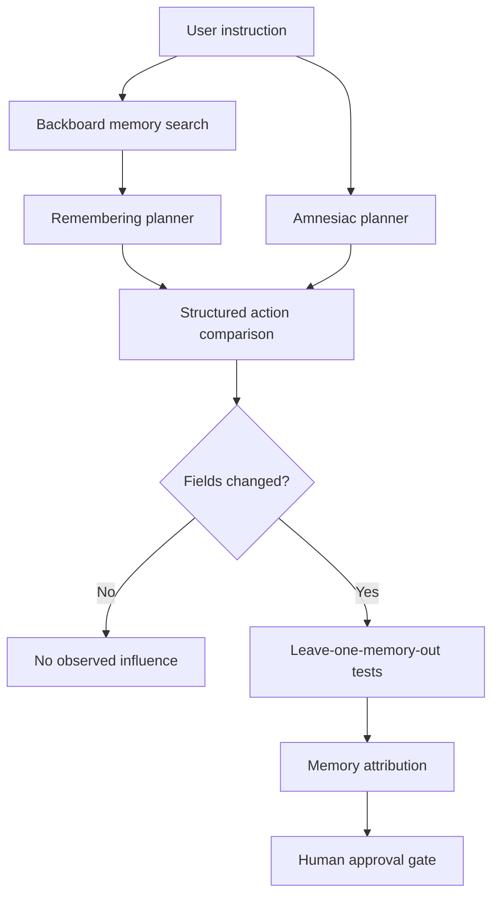

# ShadowRecall architecture

## Purpose

ShadowRecall detects when persistent AI memory changes a structured action plan. It compares a memory-informed plan against an amnesiac control, measures the changed action fields, attributes the difference to retrieved memories, and pauses the plan for human review.

## Core experimental invariant

Both paths receive:

- The same user instruction
- The same structured planner
- The same action schemas
- The same available-slot assumptions

The intended experimental variable is memory:

- **Remembering path:** receives memories retrieved from Backboard
- **Amnesiac path:** receives an empty memory collection

This controlled design prevents ordinary prompt or model variation from being mistaken for memory influence.

## Request flow



## Guided-demo mode

Guided-demo mode uses a fixed memory fixture and controlled scheduling scenario. It requires no credentials or network connection.

Its purpose is reliable presentation and interface testing.

## Live Backboard memory mode

Live mode:

1. Authenticates to Backboard on the server.
2. Searches the configured assistant’s persistent memories.
3. Supplies retrieved memories to the remembering planner.
4. Withholds all memories from the amnesiac planner.
5. Compares the resulting structured actions.
6. Performs leave-one-memory-out attribution.

Backboard provides live memory storage and semantic retrieval. Action planning remains local and deterministic.

## Structured planner

`lib/planner.ts` supports three action families:

- `create_calendar_event`
- `send_message`
- `create_task`

Unsupported instructions return:

```json
{
  "tool": "none",
  "arguments": {},
  "rationale": "..."
}
```

The planner produces structured fields so ShadowRecall compares consequential actions rather than superficial wording differences.

## Difference engine

`lib/diff.ts` flattens each action into comparable fields.

For example:

```json
{
  "tool": "create_calendar_event",
  "date": "2026-08-15",
  "time": "09:00"
}
```

It compares every matching path and records:

- Remembering value
- Amnesiac value
- Whether the field changed

Risk is elevated for fields such as tool, recipient, amount, and date.

## Attribution method

For each retrieved memory:

1. Remove that memory.
2. Keep all other memories.
3. Regenerate the remembering plan.
4. Compare it with the amnesiac plan.
5. Count how many changed fields disappear.

The memory producing the greatest reduction is reported as the likely influencing memory.

The displayed percentage is **field coverage**:

```text
changed fields eliminated / total changed fields
```

It is not a universal statistical confidence measurement.

## Human approval boundary

The MVP produces hypothetical tool calls only.

It does not:

- Create real calendar events
- Send real messages
- Create external tasks
- Invoke arbitrary third-party tools

Approval records the user’s decision inside the interface but does not execute an external action.

## Security

- Backboard credentials remain in `.env.local`.
- API credentials are accessed only by server-side code.
- `.env.local` is excluded by `.gitignore`.
- User input is length-limited and validated with Zod.
- The planner can return only supported action types.
- Backboard failures return controlled API errors.
- No arbitrary action execution exists.

## Important files

| Path | Responsibility |
|---|---|
| `app/page.tsx` | User interface and mode selection |
| `app/api/analyze/route.ts` | Validated analysis endpoint |
| `app/api/health/route.ts` | Configuration health check |
| `lib/backboard.ts` | Live Backboard memory search |
| `lib/planner.ts` | Deterministic structured planning |
| `lib/analyze.ts` | Twin comparison and attribution |
| `lib/diff.ts` | Field differences and risk |
| `lib/demo.ts` | Guided scenario |
| `lib/schema.ts` | Runtime validation |
| `tests/` | Automated verification |

## Current limitations

- Action planning uses controlled local rules rather than a general-purpose LLM.
- Available calendar slots are fixed for the hackathon scenario.
- Multiple memories may interact in ways that single-memory removal does not detect.
- Field coverage does not measure statistical certainty.
- External actions are deliberately simulated.

## Extension path

A production version could add:

- Sandboxed tool integrations
- Configurable action schemas
- Repeated LLM trials
- Stability intervals
- Multi-memory interaction testing
- Organization-specific memory policies
- Immutable audit exports